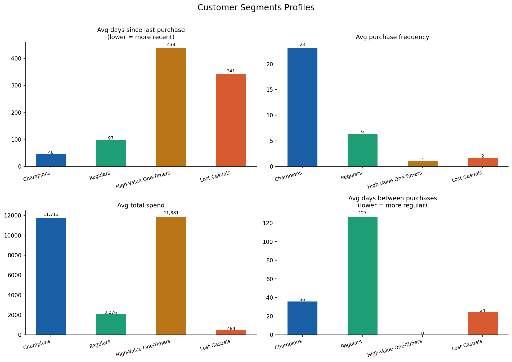
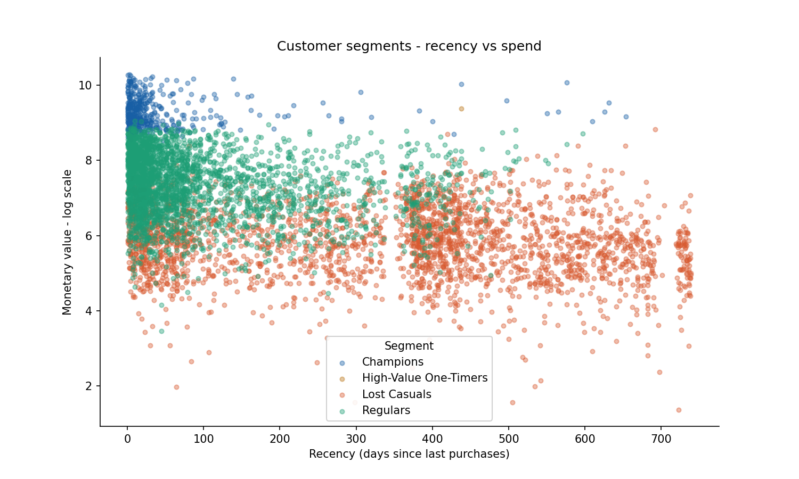

# Customer Segmentation & RFM Feature Engineering
### 27 behavioural features · K-means clustering · Actionable segment strategy · 5,817 customers

---

## Overview

Built a complete customer analytics system on 1 million rows of real retail transaction data from a UK-based online retailer. Starting from raw messy data — cancellations, returns, guest checkouts, outliers — engineered 27 customer-level features covering RFM, behavioural patterns, spend consistency, purchase timing, and seasonal shopping behaviour. Applied K-means clustering to segment 5,817 customers into 4 actionable groups with a clear commercial strategy for each.

---

## Results

| Segment | Customers | Revenue Share | Avg Spend | Avg Frequency |
|---|---|---|---|---|
| **Champions** | 425 (7.3%) | **41.4%** | £11,713 | 23 purchases |
| Regulars | 2,784 (47.9%) | 48.0% | £2,076 | 6 purchases |
| High-Value One-Timers | 1 (0.0%) | 0.1% | £11,881 | 1 purchase |
| Lost Casuals | 2,607 (44.8%) | 10.5% | £484 | 2 purchases |

**Key insight:** The top 7% of customers (Champions) drive 41% of total revenue. Winning back just 10% of Lost Casuals would generate ~£330k in incremental revenue — equivalent to acquiring 28 new Champion-level customers.

---

## Charts





---

## Dataset

**Source:** [Online Retail II — UCI Machine Learning Repository](https://archive.ics.uci.edu/dataset/502/online+retail+ii)

**Retailer:** UK-based online gift and homewares retailer
**Period:** December 2009 – December 2011
**Geography:** 38 countries

| Metric | Value |
|---|---|
| Raw rows | 1,067,371 |
| After cleaning | 805,549 |
| Unique customers | 5,817 |
| Unique products | 4,631 |
| Countries | 38 |

---

## Data Cleaning

Real retail data is messy. Five issues identified and resolved before any feature engineering:

| Issue | Rows affected | Resolution |
|---|---|---|
| Missing Customer ID (guest checkouts) | 243,007 (22.8%) | Dropped — cannot build customer profile |
| Cancelled invoices (Invoice starts with 'C') | 19,494 | Dropped — reversals not real demand |
| Negative quantities (returns/adjustments) | 22,950 | Dropped — distort monetary calculations |
| Zero or negative prices (samples, write-offs) | 6,207 | Dropped — not real transactions |
| Missing product descriptions | 4,382 | Retained — StockCode still valid |

**Total removed:** 261,822 rows (24.5%)

---

## Feature Engineering

27 features engineered across 6 categories:

### RFM Core Features
```
recency              → days since last purchase (lower = more recent)
frequency            → number of unique invoices
monetary             → total revenue generated
avg_order_value      → mean spend per invoice
avg_basket_size      → mean items per invoice
avg_unique_skus      → mean distinct products per invoice
```

### RFM Scores (1–5 scale)
```
R_score    → recency quintile    (5 = most recent)
F_score    → frequency quintile  (5 = most frequent)
M_score    → monetary quintile   (5 = highest spend)
RFM_score  → concatenated score  (e.g. "555" = Champion)
RFM_total  → sum of R+F+M scores
```

### Purchase Timing Features
```
favourite_hour        → hour of day customer most often shops
favourite_dow         → day of week customer most often shops
pct_weekend_orders    → proportion of orders placed on weekends
pct_morning_orders    → proportion of orders placed before noon
```

### Behavioural Features
```
unique_products          → total distinct products ever purchased
unique_countries         → distinct ship-to countries (B2B proxy)
total_items_bought       → total units purchased across all orders
spend_cv                 → coefficient of variation of order spend
                           (high = erratic buyer, low = consistent)
```

### Interpurchase Time Features
```
avg_days_between_purchases  → mean gap between consecutive orders
std_days_between_purchases  → variability of that gap
tenure_days                 → days between first and last purchase
```

### Seasonal Features
```
revenue_q1    → total spend in Q1 (Jan–Mar)
revenue_q2    → total spend in Q2 (Apr–Jun)
revenue_q3    → total spend in Q3 (Jul–Sep)
revenue_q4    → total spend in Q4 (Oct–Dec)
```

---

## Approach

```
Raw data (1,067,371 rows)
      ↓
Data cleaning
  • Drop guest checkouts, cancellations,
    returns, zero-price transactions
  • 805,549 clean rows remain
      ↓
Invoice-level aggregation
  • Revenue, basket size, unique SKUs per visit
      ↓
Customer-level feature engineering
  • 27 features: RFM · timing · behaviour
    · consistency · tenure · seasonality
      ↓
Outlier separation
  • 61 wholesale accounts (top 1% spend
    or frequency > 100) segmented separately
  • 5,817 retail customers for K-means
      ↓
K-means clustering
  • StandardScaler normalisation
  • Elbow + Silhouette analysis → k=4
  • Segments named by profile interpretation
      ↓
Business strategy output
  • Per-segment commercial actions
  • Revenue opportunity sizing
```

---

## Why k=4 Despite Silhouette Suggesting k=2

The silhouette score peaked at k=2 (0.916) because a small number of wholesale buyers dominated the distance calculations — mathematically clean but commercially useless. After separating 61 wholesale accounts, k=4 on the retail segment (silhouette ~0.24) produced four interpretable, actionable segments that map directly to real marketing strategies.

**Lesson:** Optimising purely for clustering metrics produces mathematically correct but business-irrelevant segments. Domain knowledge must guide the final choice.

---

## Segment Strategy

### 🔵 Champions (425 customers · 41.4% of revenue)
Recent, frequent, high-spend, broad product range (266 unique products).

- Enrol in VIP loyalty programme — early access to new products
- Solicit reviews and referrals — highest NPS potential
- Cross-sell across catalogue — they already explore widely
- **Do not discount** — they buy at full price already

### 🟢 Regulars (2,784 customers · 48.0% of revenue)
Solid mid-tier. Return every 127 days, moderate spend.

- Personalised reactivation email/push to nudge toward Champion behaviour
- Bundle offers to grow avg order value from £348 toward £500+
- Loyalty points accelerator — double points for next 30 days
- Target with new arrivals in their favourite categories

### 🟡 High-Value One-Timers (1 customer · 0.1% of revenue)
Single large visit, never returned. Likely a business buyer.

- Highest-priority win-back — one visit worth £11,881
- Personalised outreach referencing original purchase
- Offer trade account or B2B pricing
- 3-touch win-back email sequence over 30 days

### 🔴 Lost Casuals (2,607 customers · 10.5% of revenue)
Low spend, infrequent, haven't purchased in ~11 months.

- Low investment — one re-engagement attempt then sunset
- Mass discount offer (20% off) as final win-back
- Suppress from expensive channels (direct mail, paid social)
- Analyse exit patterns to identify preventable churn signals

---

## Revenue Opportunity

| Action | Target | Estimated Uplift |
|---|---|---|
| Convert 10% of Lost Casuals to Regulars | 261 customers | ~£330k |
| Increase Regular avg order value by 30% | 2,784 customers | ~£1.7M |
| Prevent 5% Champion churn | 21 customers | ~£246k |

---

## Project Structure

```
customer-segmentation-rfm/
│
├── 01_customer_feature_engineering.ipynb  ← full analysis
├── segment_profiles.png                   ← 4-metric segment chart
├── segment_scatter.png                    ← recency vs spend scatter
├── segment_summary.csv                    ← segment stats table
├── customer_features.csv                  ← full 27-feature dataset
└── README.md
```

---

## Setup

```bash
git clone https://github.com/KaraboMosala/customer-segmentation-rfm
cd customer-segmentation-rfm
pip install pandas numpy scikit-learn matplotlib openpyxl
```

Download the dataset from [UCI](https://archive.ics.uci.edu/dataset/502/online+retail+ii) and update the `PATH` variable in the notebook.

**Dependencies**
```
pandas>=2.0 · numpy>=1.24 · scikit-learn>=1.3 · matplotlib>=3.7 · openpyxl>=3.1
```

---

## Author

**Karabo Mosala**

---

*Dataset: Online Retail II via UCI Machine Learning Repository. Dr. Daqing Chen, School of Engineering, London South Bank University.*